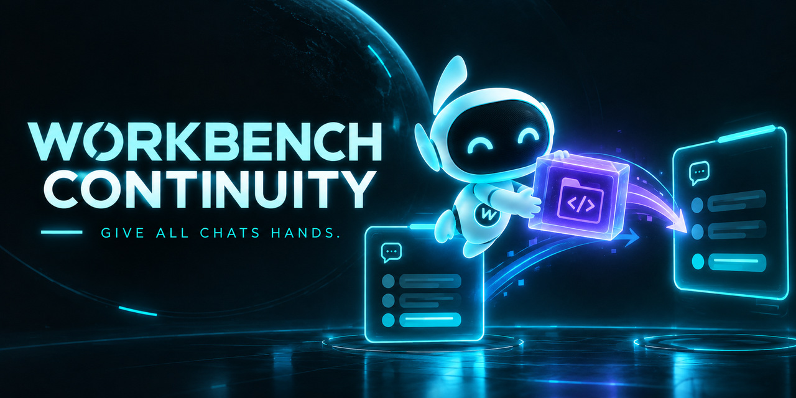

# Workbench Continuity

Carry the project, the tools, and what you were doing into the next chat.

Workbench keeps your actual source, APKs, attachments, decisions, build results and next action together. It prepares a working bundle for another chat, including Claude PDF carriers or Grok ZIP carriers. The Android app also signs returned APKs privately on your device using your existing project key.

The aim is simple: give chats hands, and let the work travel with you.

## Start here

1. Download and extract **Workbench_Continuity_v1.2.0_PUBLIC.zip** from Releases.
2. Open the included HTML on a laptop, or install the included APK on Android 9 or newer.
3. For build tools, run **SETUP_WORKBENCH.bat** once on Windows. Read Google's agreement and choose whether to accept it. In Workbench, select **Load build runtime** and open the ZIP that setup creates.

Everything needed for that setup is included in Workbench. You do **not** need to download Android Build Capsule separately. A runtime you previously made with the public Build Capsule can also be loaded.

The interface works locally. After first-time setup, exporting the project and build tools works offline. Keep the generated runtime ZIP as your recovery copy; local storage can be cleared or run out of space. **First-time setup** in the interface also saves a copy of the included setup package.

## Keep working

Open your project files, set what the next chat should do, choose **Work packet**, **Claude**, or **Grok**, and prepare the bundle. Its `START_HERE.txt` lists exactly which files to attach. Bring the edited work packet back into Workbench to continue.

The project engine, file intake, notes, large-file transport and private Android signing workflow are retained from v1.2.0. Projects with other recipes still travel with their real files; missing compilers or inputs are reported. The included SDK profile builds plain Java and resources, and retains the existing bridge adapters. It does not supply Gradle dependencies, Kotlin/Compose or the NDK. The receiving chat needs code execution on Linux x86_64, Python 3.10+ and JDK 17+; upload limits and host restrictions still apply.

On Android, **Sign returned APK** lets you select your project key outside the workspace, compare with a reference APK or installed app, and save a signed APK and public receipt. Keys and passwords stay outside AI packets. Desktop HTML carries projects and tools; private signing is an Android feature.

## Public release and privacy

The download contains Workbench, its source/setup machinery and a public Apache-licensed signing library. It contains no owner signing key, Google SDK runtime, private carrier payload or owner project QA corpus. Each person generates their own SDK runtime during setup. Keep those runtime ZIPs, generated destination bundles and signing keys private.

The public Android app uses `dev.wakka.continuity.publicv12` so it can install beside the owner's private `dev.wakka.continuity.v12` installation. Move projects by exported work packets. It does not update that private app. Future public updates require the public release signing identity, retained separately by the maintainer.

## Build and inspect

See [BUILD.md](BUILD.md) for source assembly and Android builds, [VERIFICATION.md](VERIFICATION.md) for checks and their limits, and [PRIVACY.md](PRIVACY.md) for the public/private boundary.

Workbench's original code is MIT. The integrated public [Android Build Capsule](https://github.com/Wakkatobakka/android-build-capsule) machinery is MIT and pinned in `vendor/PROVENANCE.json`. The published apksig library is Apache-2.0; its notices and artifact pin are in `third-party/`. Downloaded SDK components retain Google's terms and their component notices.
